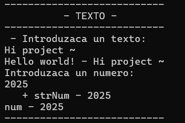
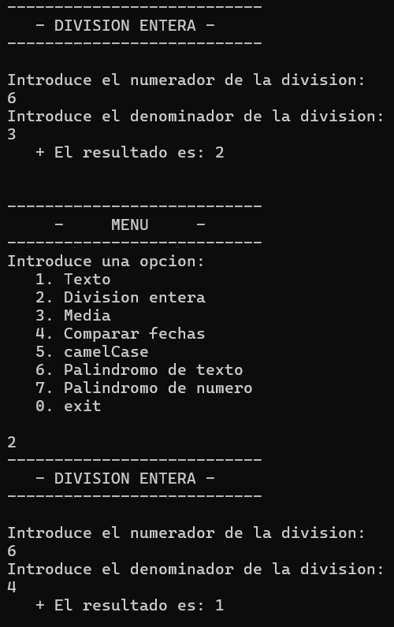
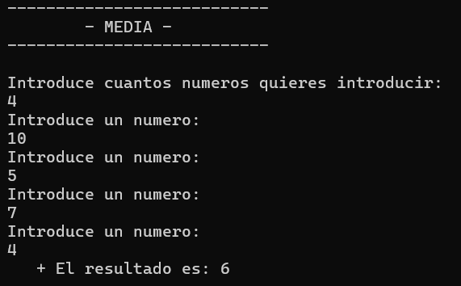
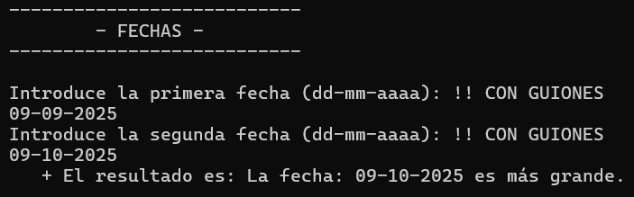
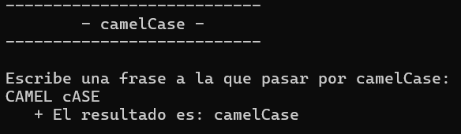
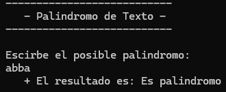
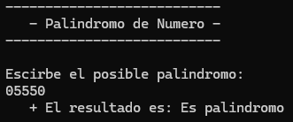

# ConsoleApp01

## Goal
Reproduce and consolidate previous logic and code-design exercises from earlier in the bootcamp, all grouped behind a single console menu.

## Description
This was my first bootcamp project. It's a menu-driven console app where each option runs a different logic exercise. On execution, a menu is displayed and the user picks an option by number.

## Exercises

| # | Exercise | Description | Screenshot |
|---|---|---|---|
| 1 | **Text** | Reads and writes console input/output; parses data as needed and returns it |  |
| 2 | **Integer Division** | Reads a numerator and denominator and computes the integer quotient manually, looping subtraction instead of using `/` |  |
| 3 | **Average** | Asks how many numbers will be entered, stores them in an array, and computes their average |  |
| 4 | **Compare Dates** | Reads two dates in `dd-mm-aaaa` format and determines which one is more recent |  |
| 5 | **camelCase** | Converts a sentence typed by the user into camelCase |  |
| 6 | **Text Palindrome** | Checks whether a given string reads the same forwards and backwards |  |
| 7 | **Number Palindrome** | Checks whether a given number is a palindrome |  |

## Concepts practiced
- Console I/O (`Console.ReadLine`, `Console.WriteLine`)
- Parsing and type conversion (`int.Parse`)
- Loops and control structures (`while`, `do-while`, `switch`)
- Arrays
- String and character manipulation (`ToCharArray`, `Char.ToUpper`, `Char.ToLower`)
- Basic algorithmic thinking (integer division without `/`, palindrome checking)

## ▶️ How to run
1. Open 1_ConsoleApp1/ConsoleApp1.sln.
2. Press Ctrl+F5 (Start Without Debugging) or F5.

## Possible improvements
- Extract each exercise into its own class/file to improve readability as the menu grows.

---
⬅️ [Back to Introduction to .NET](../)