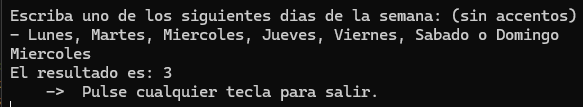

# Week Day — *CarmenPPerez_DiaDeLaSemana*

## Goal
Practice conditional control structures (`switch`) and text input validation.

## Description
The program asks the user to type the name of a weekday in Spanish (no accents: *Lunes, Martes, Miércoles...*) and returns its numeric position (1 = Monday ... 7 = Sunday). If the input doesn't match a valid day, the user is informed of the error.

## How it works
1. The day is requested through the console.
2. The text is normalized (`Trim().ToLower()`) to avoid errors from casing or extra spaces.
3. A `switch` statement maps the day name to its corresponding number.

## Concepts practiced
- `switch` statement
- String normalization
- Functions with return values

## ▶️ How to run
1. Open `2_WeekDay/CarmenPPerez_DiaDeLaSemana.sln`.
2. Press `Ctrl+F5` (Start Without Debugging) or `F5`.

---
⬅️ [Back to Introduction to .NET](../)
