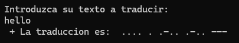

# Morse Translator — *TraductorDeMorse*

## Goal
Practice using `Dictionary<TKey, TValue>` and LINQ to perform lookups in both directions (key→value and value→key).

## Description
Console application that translates text into Morse code and Morse code into text, automatically detecting the direction of translation based on the input content:

- If the input contains only dots, dashes and spaces → it's treated as **Morse** and translated into letters.
- If it contains letters or digits → it's translated into **Morse**.
- If both alphabets are mixed, the user is warned that they cannot be combined.

## How it works
1. A dictionary `letter → Morse code` is built for the whole alphabet and digits 0-9.
2. LINQ (`All(...)`) is used to analyze the user input and decide the translation direction.
3. The input is processed character by character (or token by token, split by spaces) to build the result.

## Concepts practiced
- `Dictionary<string, string>`
- LINQ (`First`, `All`)
- Dynamic lists (`List<string>`)
- Menu loops (`do-while`)

## ▶️ How to run
1. Open `3_MorseTranslator/TraductorDeMorse.sln`.
2. Press `Ctrl+F5` (Start Without Debugging) or `F5`.

## Possible improvements
- Support full sentences with real spaces (currently space is used as a letter separator in Morse).
- Add exception handling for Morse codes that don't exist in the dictionary.

---
⬅️ [Back to Introduction to .NET](../)