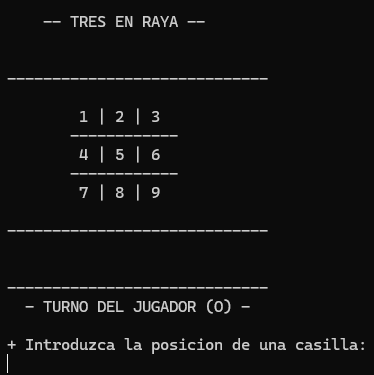
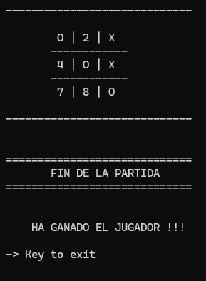

# Tic Tac Toe — *CarmenPTresEnRaya*

## Goal
Implement the full logic of a turn-based game: win detection, draw detection and move validation, using only arrays and control structures.

## Description
Classic Tic-Tac-Toe played in the console against the computer. The player is `O` and the computer (which picks a random free cell) is `X`. After every turn the game checks for a winning line (horizontal, vertical or diagonal) or a filled board with no winner.

## ⚙How it works
1. The board is represented as a 9-position array.
2. On odd turns the player plays; on even turns, the computer.
3. `ComprobarRaya()` checks all 8 possible winning combinations.
4. `HayEmpate()` checks whether any cells remain free.
5. The final result is displayed based on the turn code (`-1` player wins, `-2` computer wins, `-3` draw).

 

## Concepts practiced
- Arrays and iteration
- Turn logic driven by state variables
- Random numbers (`Random`)
- Splitting responsibilities into small methods

## ▶️ How to run
1. Open `4_TicTacToe/CarmenPTresEnRaya.sln`.
2. Press `Ctrl+F5` (Start Without Debugging) or `F5`.

## Possible improvements
- Review `isPosicionOcupada`: the current condition (`||` instead of `&&`) doesn't correctly detect already-occupied cells.
- Give the computer a minimal strategy instead of fully random moves.

---
⬅️ [Back to Introduction to .NET](../)
