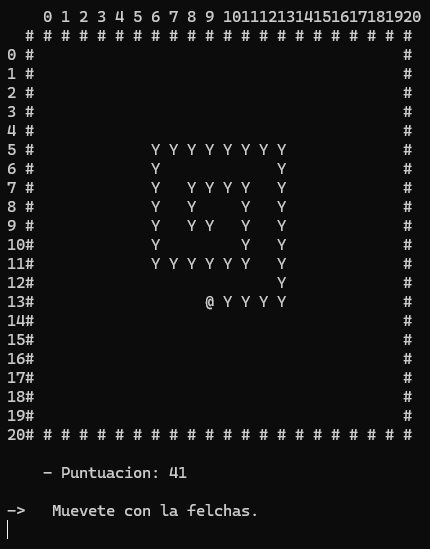

# Snake V1 — *CarmenPPerez_Snake*

## Goal
A first approach to a real-time game inside a console: representing a board as a matrix, tracking positions and capturing keyboard input.

## Description
Initial version of the classic **Snake** game. The user sets the board size, controls the snake with the arrow keys, and it keeps growing with every move (an "infinite snake" version: there's no food, it grows indefinitely until it hits a wall or its own body).

## How it works
1. A board (`string[,]`) is generated with borders (`#`) and numeric guides for orientation.
2. The snake is represented as a `List<Point>`, with the first element being the head.
3. On every iteration, the pressed arrow key is read, the next position is calculated, and collisions against borders (`#`) or the body (`Y`) are checked.
4. The game ends by showing the score (the snake's length) upon collision.

## Concepts practiced
- Two-dimensional arrays (`string[,]`)
- `System.Drawing.Point` for coordinates
- Dynamic lists (`List<Point>`)
- Real-time key reading (`Console.ReadKey`)

## ▶️ How to run
1. Open `5_SnakeV1/CarmenPPerez_Snake.sln`.
2. Press `Ctrl+F5` (Start Without Debugging) or `F5`.

## Possible improvements (already hinting at a V2)
- Add food so the snake only grows when it eats.
- Replace the "infinite snake" model with one of limited length.
- Control the refresh rate instead of relying on key presses.

---
⬅️ [Back to Introduction to .NET](../)