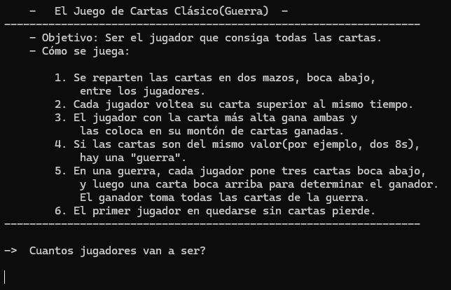

# Card Battle — *CarmenPPerez_BatallaDeCartas*

## Goal
Extend the card/deck model from the previous project to implement a full game with rules, multiple players and recursive tie-breaking logic.

## Description
Implementation of the classic card game **"War"**:
1. The full deck is split evenly between 2 to 5 players.
2. In each round, all players reveal their top card at the same time.
3. Whoever has the highest card takes all the cards on the table.
4. If two or more players tie, a **"war"** begins: each tied player places 3 cards face down and 1 face up to decide the winner of that round.
5. The game is won by whoever collects all 52 cards.

## Architecture
- `Carta` (Card) — number, suit and current owner.
- `Baraja` (Deck) — collection of cards with shuffle, deal and draw operations.
- `Jugador` (Player) — their card deck and their won points.
- `JuegoDeBatalla` (Game) — orchestrates the match: dealing, turns, tie processing and win condition.

## Concepts practiced
- Relationships between classes (`Jugador` ↔ `Baraja` ↔ `Carta`)
- Recursion (`ProcesarCartas()` calls itself inside `Empate()`)
- LINQ (`OrderByDescending`, `FindAll`)
- Complex business logic with multiple conditions

## ▶️ How to run
1. Open `CarmenPPerez_BatallaDeCartas/CarmenPPerez_BatallaDeCartas.sln`.
2. Press `Ctrl+F5` (Start Without Debugging) or `F5`.

## 💡 Development notes
The code itself includes `// todo` comments pointing out things to polish (e.g. how decks are split when the number of cards isn't evenly divisible among players). Good candidates for a refactor session.

---
⬅️ [Back to Classes](../)