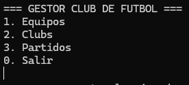
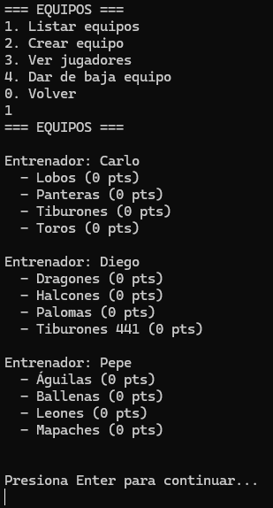
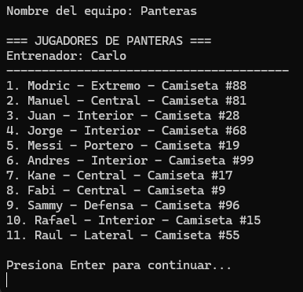
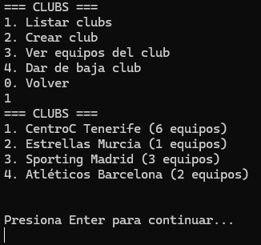
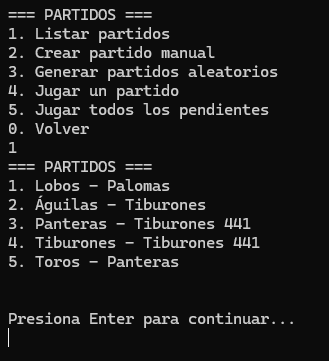

# Football Club — *ClubDeFutbol*

## Goal
The most advanced project in the Classes section: managing several related entities (clubs, teams, players and matches) with **real data persistence in JSON**.

## Description
Console-based sports manager app with three main modules accessible from a menu:

- **Teams** — list, create (with 11 auto-generated players), view roster, and deactivate.
- **Clubs** — list, create, view affiliated teams, and deactivate.
- **Matches** — create manual or randomly generated matches, play them (random result) and view the list.

All data (`clubs.json`, `equipos.json`, `partidos.json`) is loaded on startup and saved automatically after every operation, so the state persists between runs.

## Architecture
- `Jugador` (Player) — name, position and jersey number.
- `Equipo` (Team) — list of players, coach, score and affiliated club.
- `Club` — list of teams, with automatic coach rotation when a team is added.
- `Partido` (Match) — home/away teams, score and point allocation (3 for a win, 1 for a draw).
- `Generador` (Generator) — generates test data (names, positions, random clubs and teams) to seed the system on startup.

## Concepts practiced
- Serialization/deserialization with `Newtonsoft.Json` via DTO classes (avoiding circular references when saving)
- `Dictionary<string, Equipo>` for fast lookups
- Advanced LINQ (`GroupBy`, `OrderBy`, `Select`)
- Separation of concerns between domain logic and console menus

## ▶️ How to run
1. Open `ClubDeFutbol/ClubDeFutbol.sln`.
2. Visual Studio will restore the `Newtonsoft.Json` NuGet package automatically (listed in `packages.config`) on first build.
3. Press `Ctrl+F5` (Start Without Debugging) or `F5`.

---
⬅️ [Back to Classes](../)
