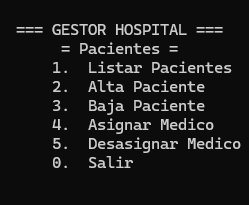

# Hospital — *CarmenPPerez_Hospital*

## Goal
Design a realistic class hierarchy to model the different types of people involved in a hospital, applying inheritance, generics and many-to-many relationships between objects.

## Description
Console-based hospital management system that allows adding and removing doctors, patients and administrative staff, as well as assigning and unassigning patients to doctors. Includes a demo data generator to populate the hospital on startup.

## Class hierarchy
```
Persona (base class)
├── Paciente (Patient)
└── Personal (Staff)
    ├── Medico (Doctor)
    └── Administrativo (Admin staff)
```

- `Persona` (Person) — name and base text representation.
- `Personal` (Staff) — adds the reference to the `Hospital` the staff member works at.
- `Medico` (Doctor) — keeps a list of assigned patients (`ListPacientes`).
- `Paciente` (Patient) — keeps a reference to their assigned doctor, with logic to assign/unassign while keeping state consistent.
- `Administrativo` (Administrative) — adds a role (`enum eCargo`).
- `Hospital` (Hospital) — orchestrates the collection of people and exposes generic operations (`AltaPersona`, `BajaPersona`, `GetPersonasPorTipo<T>`, `ListarPorTipo<T>`).



## Concepts practiced
- Inheritance and `base()` in constructors
- Generic methods and classes with constraints (`where T : Persona`)
- Bidirectional relationships between objects (Doctor ↔ Patient) while keeping consistency on assign/unassign
- Using `is` / `as` to check and cast types at runtime
- Nested console menus

## ▶️ How to run
1. Open `CarmenPPerez_Hospital/CarmenPPerez_Hospital.sln`.
2. Press `Ctrl+F5` (Start Without Debugging) or `F5`.

---
⬅️ [Back to Inheritance](../)