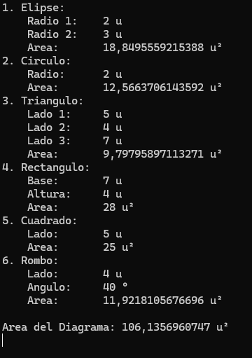

# 2D Shapes — *CarmenPPerez_Forma2D*

## Goal
A classic **polymorphism** example: different geometric shapes share a common interface (`GetArea()`) but each one calculates its area with its own formula.

## Description
The program builds a `Diagrama` (diagram) that groups together several geometric shapes (ellipse, circle, triangle, rectangle, square and rhombus) and computes both each shape's individual area and the diagram's total area, without needing to know the concrete type of each shape.

## Class hierarchy
```
Forma (abstract)
├── Elipse
│   └── Circulo
└── Poligono
    ├── Triangulo
    └── Rectangulo
        └── Cuadrado
            └── Rombo
```

- `Forma` (Form) — abstract class with the `GetArea()` method every shape must implement.
- `Elipse` (Ellipse) / `Circulo` (Circle) — the circle inherits from the ellipse by making both radii equal.
- `Poligono` (Polygon) — common base for shapes defined by a base and a height.
- `Rectangulo` (Rectangle) → `Cuadrado` (Square) → `Rombo` (rhombus) — each class reuses and specializes its parent's behavior (the square fixes base = height; the rhombus adds an angle for its area formula).
- `Triangulo` (Triangle) — computes its area with **Heron's formula** from its three sides.
- `Diagrama` (diagram) — holds a collection of `Forma` and sums the total area without knowing the concrete type of each one (pure polymorphism).

## Concepts practiced
- Abstract classes and abstract methods (`abstract double GetArea()`)
- Multi-level inheritance and reuse of `protected` properties
- Polymorphism when iterating over `Dictionary<int, Forma>` in `Diagrama`
- Overriding `ToString()` to present each shape with its own format



## ▶️ How to run
1. Open `CarmenPPerez_Forma2D/CarmenPPerez_Forma2D.sln`.
2. Press `Ctrl+F5` (Start Without Debugging) or `F5`.

## Note
The code itself flags with a `// todo` comment that the `Rombo` (rhombus) area calculation isn't fully correct (the formula uses the angle in radians when it's most likely entered in degrees). A good candidate for a fix using `Math.PI / 180`.

---
⬅️ [Back to Inheritance](../)